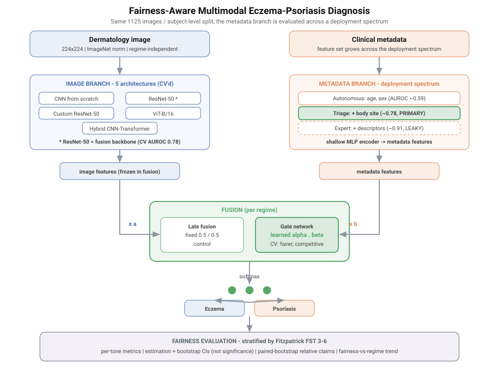
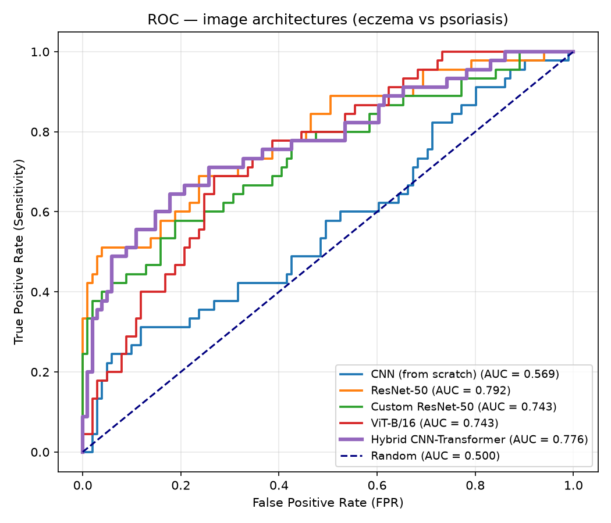
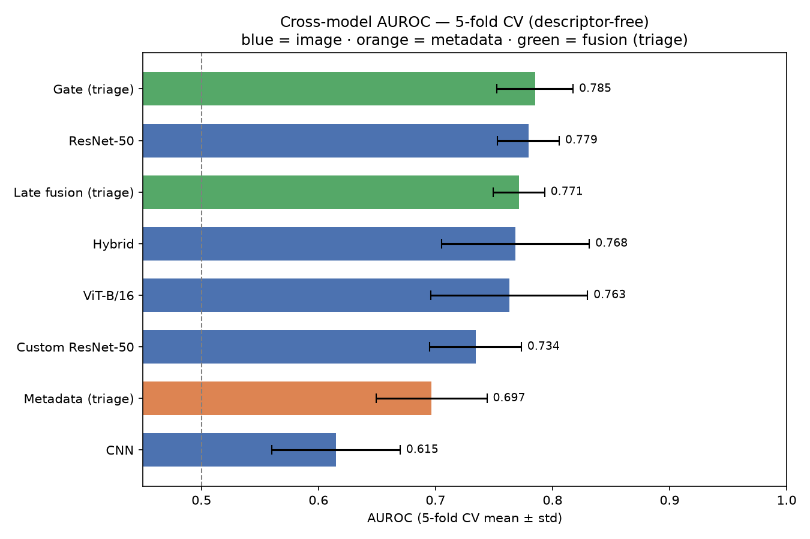
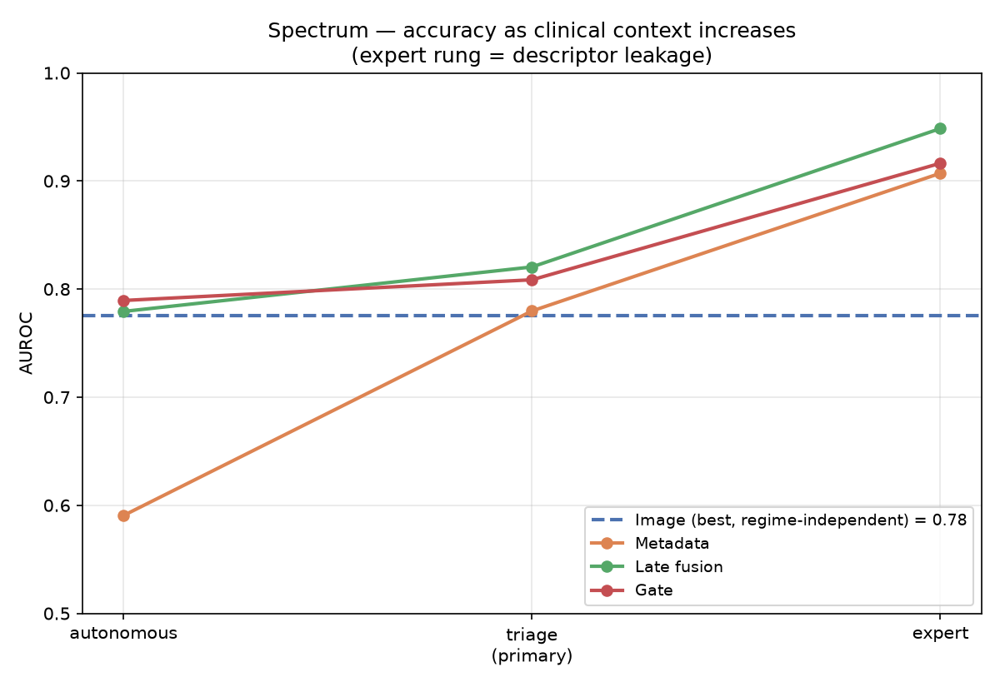
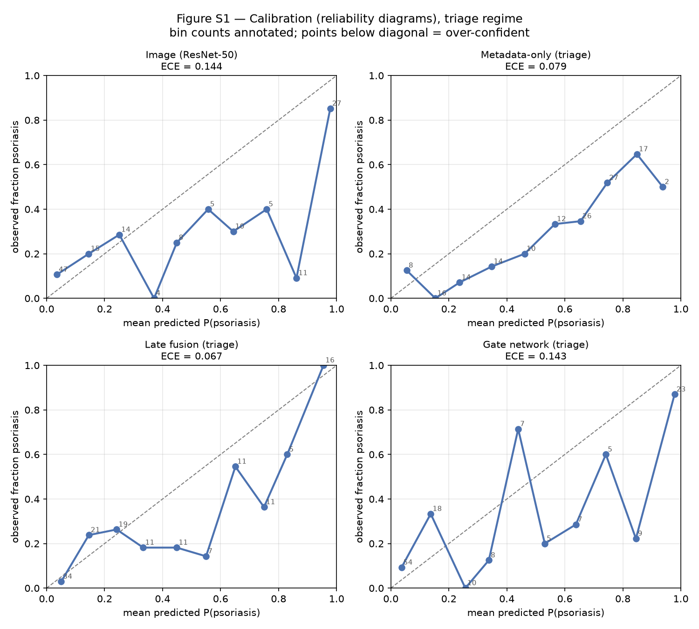
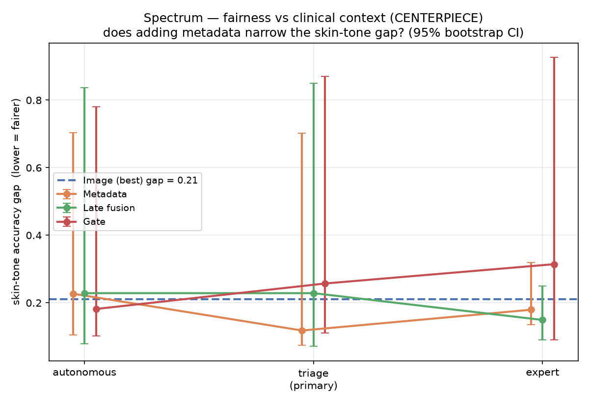
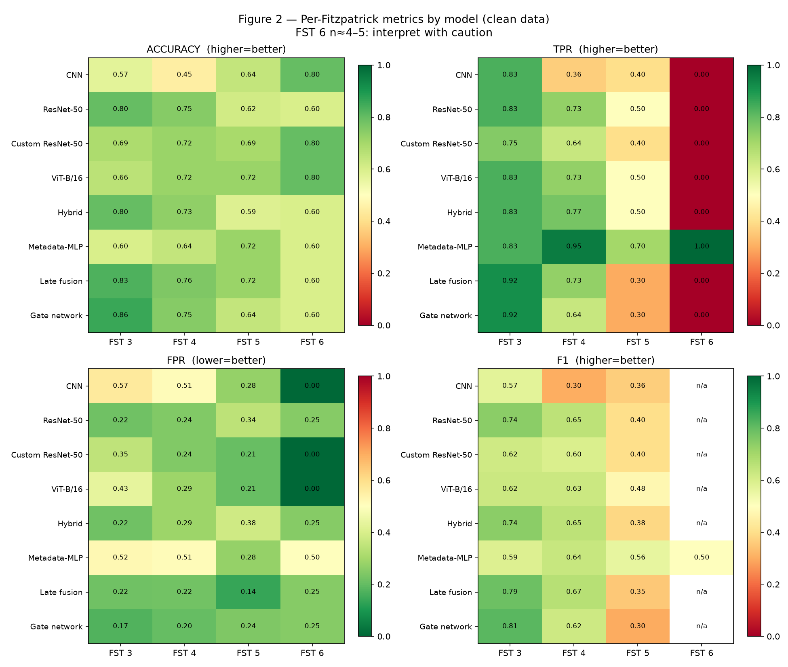
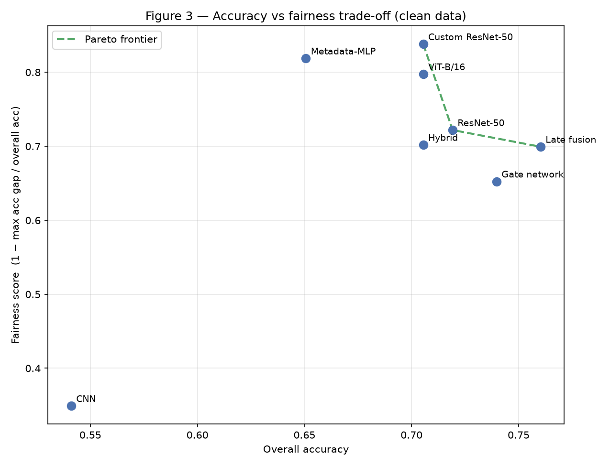
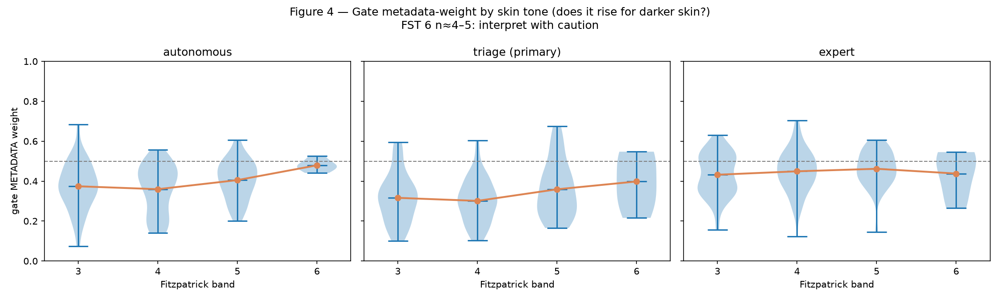

# Fairness-Aware Multimodal Deep Learning for Eczema–Psoriasis Differentiation Across a Clinical-Information Spectrum: Algorithm Development and Validation

**Authors:** [Author 1]¹; [Author 2, degree]²
¹[Affiliation 1]
²[Affiliation 2]

**Corresponding Author:**
[Author 1]
[Address]
[Email]

---

## Abstract

**Background:** Deep learning systems for dermatology have repeatedly been shown to underperform on darker skin, raising concerns about equitable clinical deployment. Most such systems are image-only and are evaluated without stratifying performance by skin tone. The differentiation of eczema from psoriasis—two common inflammatory dermatoses with overlapping clinical morphology—is a frequent and consequential diagnostic decision, yet it has been little studied through the lens of skin-tone fairness or multimodal modeling.

**Objective:** This study aimed to (1) benchmark a range of image architectures and multimodal fusion strategies for eczema–psoriasis differentiation, (2) evaluate every model for fairness across Fitzpatrick skin-tone bands using a rigorous, leakage-controlled protocol, and (3) characterize how diagnostic performance and fairness change as increasing amounts of routinely available clinical metadata are supplied, reflecting a spectrum of realistic deployment scenarios.

**Methods:** Using 1125 dermatologic images from a single cohort spanning Fitzpatrick skin types III–VI, we trained and evaluated five image backbones (a convolutional network trained from scratch, ResNet-50, a custom frozen-backbone ResNet-50, a Vision Transformer, and a hybrid convolutional-transformer), a metadata-only model, a fixed late-fusion model, and a learned gate-network fusion model. Metadata availability was varied across three nested regimes—autonomous (age and sex), triage (adding body site), and expert (adding morphologic descriptors). Data were partitioned at the patient level with joint stratification by class and skin tone, and models were evaluated with five-fold cross-validation. Because per–skin-tone cell counts were small, results are reported as point estimates with bootstrap confidence intervals and paired-bootstrap relative comparisons rather than null-hypothesis significance tests. A formal leakage audit and trivial baselines were used to establish data integrity and a performance floor.

**Results:** Image-only performance was modest, with the strongest backbone (ResNet-50) reaching a cross-validated area under the receiver operating characteristic curve (AUROC) of 0.779 (SD 0.026). Metadata performance increased monotonically with clinical context (AUROC 0.591, 0.780, and 0.907 across the autonomous, triage, and expert regimes). Morphologic descriptors were found to leak diagnostic information: removing them reduced metadata AUROC from 0.894 to 0.795. In the leakage-free triage regime, multimodal fusion was at least as accurate as the best single modality and clearly exceeded metadata alone; under cross-validation the gate network achieved the highest AUROC (0.785, SD 0.033) and the smallest skin-tone accuracy gap (0.193), narrowly surpassing fixed late fusion (AUROC 0.771; gap 0.253). Skin-tone disparities were modest but statistically indistinguishable at this sample size. The gate network exhibited a consistent but non-significant tendency to weight metadata more heavily for darker skin.

**Conclusions:** In a realistic triage setting, combining images with simple, routinely available clinical metadata matched or exceeded the best single-modality model for eczema–psoriasis differentiation, and a learned fusion gate was competitive with and better calibrated for fairness than fixed fusion. Expert morphologic descriptors carry substantial label leakage and should be handled cautiously. Skin-tone fairness could not be established or refuted at this sample size, underscoring the need for larger, tone-balanced datasets. We release the full evaluation protocol as an open, reusable toolkit. These findings represent a proof-of-concept rather than a deployment-ready system.

**Keywords:** eczema; psoriasis; dermatology; artificial intelligence; deep learning; algorithmic fairness; Fitzpatrick skin type; multimodal learning; clinical metadata; differential diagnosis

---

## Introduction

Eczema (atopic and related dermatitides) and psoriasis are among the most common chronic inflammatory skin conditions encountered in primary and specialty care [ref—epidemiology of eczema and psoriasis]. Although their underlying pathophysiology, natural history, and histology are well characterized [ref], their surface presentations frequently overlap: both may present as erythematous, scaly plaques, and their distinction can be genuinely difficult even for experienced clinicians [ref—diagnostic difficulty]. Misclassification is not benign. The two conditions diverge sharply in management—topical and systemic therapies effective for one may be ineffective or counterproductive for the other—so a confident, timely, and correct differentiation materially affects treatment trajectory and patient burden [ref].

The conventional diagnostic pathway depends on access to dermatologic expertise, which is unevenly distributed. Patients in under-resourced settings frequently face long waits or lack specialist access entirely, and initial assessment often falls to primary-care clinicians or the patients themselves [ref—dermatology access disparities]. This access gap has motivated a large body of work applying deep learning to dermatologic image classification, with the aspiration of supporting triage at or near the point of first contact [ref—deep learning in dermatology]. Much of this work has focused on skin cancer and has reported strong performance on curated, predominantly light-skinned image datasets [ref—Esteva et al.; ref—ISIC]. Table 1 summarizes representative prior approaches and their reported performance.

**Table 1.** Summary of prior machine-learning approaches to dermatologic classification and multimodal medical prediction. *[To be completed with literature values and citations.]*

Two limitations of this literature are directly relevant to the present study. First, a growing body of evidence indicates that dermatology artificial intelligence systems underperform on darker skin, reflecting the underrepresentation of higher Fitzpatrick skin types in training data and the reduced image contrast of many lesions on pigmented skin [ref—Groh et al. fairness; ref—skin-tone bias]. Because fairness is rarely evaluated in a stratified manner, such disparities can remain undetected until deployment, where they have the greatest potential for harm. Second, most systems are image-only, discarding the structured clinical context—patient age, sex, the anatomic distribution of lesions, and morphologic features—that clinicians routinely integrate when reasoning about a differential [ref—multimodal clinical reasoning]. Prior multimodal work in dermatology has shown that adding tabular metadata can improve accuracy and reduce error rates [ref—multimodal dermatology], but the interaction between multimodal fusion and skin-tone fairness has received little attention.

A further, often-overlooked complication concerns the provenance of metadata features. In many curated datasets, morphologic descriptors (for example, "plaque," "scale," or "lichenification") are recorded by the same clinician who assigned the diagnostic label. A model trained on such descriptors may therefore recover the label through a proxy rather than through independent signal, inflating apparent performance in a way that will not reproduce in deployment, where expert descriptors are unavailable at the point of image capture. Distinguishing genuinely predictive, patient-reportable context from clinician-derived reasoning is essential to any honest claim of clinical utility.

This study addresses these gaps through three contributions. First, we present a Fitzpatrick-stratified fairness benchmark that compares five image architectures and two multimodal fusion strategies for eczema–psoriasis differentiation under an identical, leakage-controlled evaluation protocol. Second, we introduce a deployment-scenario spectrum that systematically varies the amount of clinical metadata supplied to the model—from demographics alone, to demographics plus body site, to the further addition of expert morphologic descriptors—allowing us to characterize how both accuracy and fairness respond to increasing clinical context, and to quantify the point at which descriptor-based leakage appears. Third, we release the complete fairness-evaluation methodology as an open, reusable software protocol that operates on any classifier's predictions together with a group vector, so that the analysis can be extended to other conditions and larger cohorts. Throughout, we adopt an estimation-based statistical framing appropriate to small per-group samples, reporting confidence intervals and relative comparisons rather than significance tests, and we position our results as a proof-of-concept and a methodological contribution rather than as a deployment-ready diagnostic.

---

## Methods

### Overview

Our approach comprises four stages: (1) construct a clean, leakage-controlled, patient-level dataset partition stratified jointly by class and skin tone; (2) train and evaluate five image architectures under an identical protocol; (3) train a metadata model and two multimodal fusion models—fixed late fusion and a learned gate network—across three nested metadata regimes constituting a deployment spectrum; and (4) evaluate all models for skin-tone fairness using per-tone metrics, bootstrap confidence intervals, and relative (paired-bootstrap) comparisons, supported by a formal leakage audit and trivial baselines. The complete pipeline is summarized in Figure 1.

**Figure 1.** Study pipeline. The image branch (five architectures) and the metadata branch (evaluated across the autonomous → triage → expert information spectrum, applied to identical images and partitions) are combined by fixed late fusion or a learned gate network, and every model is evaluated for fairness across Fitzpatrick bands.

### Dataset

The dataset comprised dermatologic images with accompanying structured metadata drawn from a single cohort [ref—dataset citation]. From the full collection, we selected images belonging to two inflammatory disease families defined at the subclass level: an eczema/dermatitis class and a psoriasis/lichenoid class. This yielded 1145 images prior to cleaning. Each image was accompanied by metadata fields including patient age band, sex, anatomic body site, morphologic descriptors, a Fitzpatrick skin-type label, and a de-identified subject identifier; multiple images could originate from the same subject. The cohort spanned Fitzpatrick skin types III through VI; types I and II were absent, a limitation we return to in the Discussion.

### Data Preparation and Cleaning

Several cleaning steps were applied to improve label fidelity and remove potential confounds, each documented for reproducibility. First, images that failed to load or were corrupt were removed (none were found). Second, records whose disease label fell outside the intended eczema/dermatitis and psoriasis/lichenoid families—principally superficial fungal and balanitis diagnoses that had been grouped within the broader inflammatory subclasses—were removed (7 images). Third, records annotated with the lowest clinician diagnostic confidence were removed to reduce label noise (13 images). Fourth, near-duplicate images were identified by perceptual hashing (64-bit) with pairwise Hamming distance; no near-duplicate clusters were found at a conservative threshold, indicating an absence of duplicate-driven leakage. These steps reduced the dataset from 1145 to 1125 images.

### Data Partitioning

To prevent optimistic bias from patient-level leakage, the data were partitioned by subject identifier rather than by image, so that all images from a given patient appeared in exactly one partition. Subjects were assigned to training, validation, and test partitions (70%/15%/15%) with joint stratification by class and by each subject's dominant Fitzpatrick band, ensuring that scarce darker-skin subjects were distributed proportionally across partitions rather than concentrated by chance. The identical stratification scheme was used to define five cross-validation folds; all reported cross-validated metrics use these folds. Split assignments were fixed and recorded.

### Image Models

Five image architectures were evaluated under an identical training protocol so that performance differences would be attributable to architecture rather than to differing hyperparameters. These comprised: a compact convolutional neural network trained from scratch, serving as a baseline floor; ResNet-50 initialized with ImageNet weights and fine-tuned; a custom ResNet-50 variant with a frozen pretrained backbone and a lightweight trainable classification head, reflecting a computationally constrained transfer-learning strategy; a Vision Transformer (ViT-B/16) initialized from pretrained weights; and a hybrid architecture combining a convolutional stem with a transformer encoder over the resulting spatial features. All images were resized to 224×224 pixels and normalized using standard ImageNet statistics. Training-time augmentation (horizontal flips, mild rotation, and mild color jitter) was applied to the training partition only; validation and test images were resized and normalized without augmentation. To address the approximately 1.7:1 class imbalance, an inverse-frequency class-weighted cross-entropy loss was used uniformly across models. Early stopping was performed on validation balanced accuracy. All training was performed on a CPU, which constrained the use of extensive backbone fine-tuning, ensembling, and test-time augmentation.

### Metadata Model and the Deployment Spectrum

Structured metadata were encoded into fixed-length feature vectors using one-hot encoding for single-valued categorical fields (age band, sex) and multi-hot encoding for multi-valued fields (body site, morphologic descriptors). The encoding vocabulary was fit on the training partition only, so that categories appearing solely in validation or test data did not expand the feature space. Skin tone (Fitzpatrick and Monk labels) was deliberately excluded from the feature set and reserved as the sensitive attribute for fairness analysis; the diagnostic label and its parent taxonomic fields were also excluded.

Crucially, the metadata feature set was not fixed but was varied across three nested regimes constituting a deployment spectrum, applied to the identical images and partitions:

- **Autonomous:** age and sex only—information available to any consumer-facing application.
- **Triage:** the above plus anatomic body site—information a non-expert (patient, nurse, or general practitioner) can reliably report. This regime is our primary, recommended operating point.
- **Expert:** the above plus morphologic descriptors—information typically supplied only by a trained clinician.

Because the regimes are nested feature ablations on identical data, comparisons across the spectrum are within-subject and are not confounded by differences in the underlying images or patients. Metadata models (logistic regression and a shallow multilayer perceptron) were trained within each regime; the multilayer perceptron was carried forward for fusion.

### Multimodal Fusion

Two fusion strategies combined the image and metadata branches. In **fixed late fusion**, the class-probability outputs of the best image backbone and the metadata model were averaged with equal weights, serving as a parameter-free control. In the **gate network**, a small learned module consumed normalized features from both branches and produced a per-sample softmax weighting over the two modalities, which was applied to their respective logits. To make training feasible on CPU and to isolate the contribution of fusion from further image-feature learning, the image backbone was frozen during fusion; only the metadata branch, the per-branch heads, and the gate module were trained. The metadata branch and per-branch heads were warm-started from the previously trained metadata model rather than randomly initialized, and a gate-entropy regularizer discouraged premature collapse onto a single modality. For each regime, the fusion metadata branch used that regime's feature set.

### Fairness Evaluation

Fairness was assessed by stratifying performance across Fitzpatrick bands. For each model we computed per-tone accuracy, sensitivity, specificity, and F1; across-tone gaps in accuracy, true-positive rate, and false-positive rate; equalized-odds and demographic-parity differences; and a normalized fairness score. Because per-tone cell counts were small—particularly for Fitzpatrick VI—we deliberately avoided reliance on null-hypothesis significance testing. Instead, we report point estimates with 1000-sample bootstrap confidence intervals, and we quantify relative fairness using a paired bootstrap: because all models are evaluated on the same test subjects, patient indices are resampled once per bootstrap iteration and applied to every model, yielding the probability that one model has a smaller gap than another while cancelling shared test-set variance. Kruskal–Wallis tests across tones are reported as secondary context only. Fitzpatrick VI results are treated as descriptive.

### Leakage Audit and Baselines

To substantiate that reported performance reflects genuine signal, we conducted a formal leakage audit comprising the perceptual-hash duplicate check, the patient-level partitioning described above, verification that augmentation was confined to training data, and confound probes. As a color-confound probe, a logistic regression was trained on per-channel RGB color histograms; a probe accuracy near chance indicates the task is not trivially recoverable from color or exposure. As an acquisition-source probe, we examined the class balance across the two contributing image sources. Finally, we computed trivial baselines—majority-class prediction, stratified-random prediction, and the color-histogram model—to establish a performance floor against which all models were judged.

### Ethical Considerations

This research used a de-identified dermatologic image dataset [ref—dataset ethics/IRB statement]. No new human-participant data were collected. [Insert IRB/consent statement and dataset governance details.] Because model outputs on real patient images could influence care if misapplied, we emphasize the proof-of-concept nature of this work and make no claim of clinical validity.

---

## Results

### Image Architecture Comparison

Under five-fold cross-validation, image-only performance was modest and the strongest architectures were closely clustered (Figure 2; Table 2). ResNet-50 achieved the highest cross-validated AUROC (0.779, SD 0.026) and, notably, the smallest cross-fold variance, indicating stability as well as accuracy. The hybrid convolutional-transformer (0.768, SD 0.063) and Vision Transformer (0.763, SD 0.067) achieved comparable mean performance but with substantially larger variance, indicating that their apparent strength on any single partition was less reliable. The custom frozen-backbone ResNet-50 reached 0.734 (SD 0.039), and the from-scratch convolutional network performed near the floor (0.615, SD 0.055). The differences among the top four architectures were small relative to their confidence intervals, and no single architecture could be declared superior. This clustering is visualized in the cross-model AUROC comparison and in the architecture receiver operating characteristic curves (Figure 2).

**Figure 2.** Image-architecture comparison. (A) Receiver operating characteristic curves for the five image models. (B) Cross-model AUROC with five-fold cross-validation confidence intervals; the strongest architectures are statistically indistinguishable.

**Table 2.** Cross-validated image-architecture comparison (five-fold; mean [SD]).

| Model | AUROC | Accuracy | Balanced accuracy | F1 | ECE |
|---|---|---|---|---|---|
| CNN (from scratch) | 0.615 (0.055) | 0.534 (0.058) | 0.564 (0.035) | 0.500 (0.049) | 0.106 (0.060) |
| Custom ResNet-50 (frozen) | 0.734 (0.039) | 0.686 (0.032) | 0.669 (0.051) | 0.578 (0.082) | 0.082 (0.027) |
| ViT-B/16 | 0.763 (0.067) | 0.699 (0.048) | 0.695 (0.062) | 0.618 (0.084) | 0.192 (0.064) |
| Hybrid CNN-Transformer | 0.768 (0.063) | 0.718 (0.045) | 0.686 (0.038) | 0.597 (0.047) | 0.174 (0.070) |
| ResNet-50 | 0.779 (0.026) | 0.738 (0.024) | 0.714 (0.046) | 0.626 (0.073) | 0.141 (0.038) |

### Value of Clinical Information: The Deployment Spectrum

Metadata-only performance increased monotonically as clinical context was added across the deployment spectrum (Figure 3). In the autonomous regime (age and sex only), the metadata model performed only modestly above chance (AUROC 0.591), consistent with the limited discriminative value of demographics alone. Adding body site in the triage regime raised metadata AUROC to 0.780—comparable to the best image model—reflecting the genuine diagnostic value of lesion distribution (for example, the tendency of psoriasis toward extensor surfaces and of eczema toward flexural sites). Adding morphologic descriptors in the expert regime raised metadata AUROC further to 0.907.

**Figure 3.** Value of clinical information. AUROC across the deployment spectrum for metadata-only and fusion models, relative to the regime-independent image baseline; metadata value rises monotonically as clinical context is added, with the expert rung reflecting descriptor leakage.

The large increment associated with descriptors prompted a targeted ablation, which confirmed substantial label leakage. Metadata AUROC with the full feature set was 0.894; removing descriptors reduced it to 0.795, whereas descriptors alone achieved 0.831 and body site alone achieved 0.753. Descriptors thus accounted for the majority of the apparent metadata advantage, consistent with their being clinician-derived reflections of the diagnosis rather than independent, patient-reportable signal. Accordingly, the triage regime—which excludes descriptors—was adopted as the primary, leakage-free operating point for all subsequent comparisons, and the expert regime is reported only as a labeled leakage reference.

### Multimodal Fusion in the Triage Regime

In the leakage-free triage regime, multimodal fusion matched or exceeded the best single modality and clearly exceeded metadata alone (Table 3). Under five-fold cross-validation, the gate network achieved the highest AUROC (0.785, SD 0.033), narrowly ahead of fixed late fusion (0.771, SD 0.022) and comparable to the best image backbone (0.779). The metadata-only model trailed the fusion models (0.697, SD 0.047). The absolute multimodal gain over the best image model was small and lay within cross-validation variability; the principal, reliable finding was that fusion clearly outperformed metadata alone while remaining at least as good as the strongest image model.

**Table 3.** Deployment-spectrum results. Metadata-only and fusion AUROC across the three metadata regimes (single-partition), with cross-validated triage values (five-fold; mean [SD]).

| Model | Autonomous AUROC | Triage AUROC | Expert AUROC | Triage AUROC (CV) | Triage accuracy gap (CV) |
|---|---|---|---|---|---|
| Metadata-only | 0.591 | 0.780 | 0.907 | 0.697 (0.047) | 0.199 (0.092) |
| Late fusion | 0.779 | 0.820 | 0.949 | 0.771 (0.022) | 0.253 (0.084) |
| Gate network | 0.789 | 0.809 | 0.916 | 0.785 (0.033) | 0.193 (0.100) |

Two aspects of the fusion comparison are notable. First, on a single fixed partition, fixed late fusion had appeared to lead the gate network; under cross-validation this ordering reversed, with the gate network achieving both a higher mean AUROC and a smaller mean skin-tone accuracy gap (0.193 vs 0.253). The reversal illustrates the importance of cross-validation for small datasets and indicates that the gate network is competitive with, rather than inferior to, fixed fusion. Second, the two fusion strategies differed markedly in calibration (Figure S1): fixed late fusion was the best-calibrated model (expected calibration error 0.067) and metadata-only was similarly well calibrated (0.079), whereas the gate network was poorly calibrated (0.143), comparable to the raw image model (0.144). Thus, although the gate network was competitive on discrimination and fairness, its probability estimates were less reliable, a limitation with direct implications for any confidence-thresholded clinical use.

**Figure S1.** Calibration (reliability diagrams) for the primary triage models; fixed late fusion is best calibrated, the gate network least.

### Fairness Across Skin Tones

Skin-tone disparities were modest but could not be reliably distinguished at this sample size (Figure 4; Table 4). Across all models, per-tone accuracy gaps were accompanied by wide bootstrap confidence intervals that overlapped extensively between models and across regimes, and no model exhibited a statistically significant disparity by the Kruskal–Wallis criterion. Fitzpatrick VI, represented by only a handful of test images, produced degenerate per-tone rates and is reported descriptively only. In the paired-bootstrap relative analysis, no architecture or fusion strategy was consistently fairer than the reference model across accuracy, true-positive-rate, and false-positive-rate gaps. The fairness-versus-regime analysis (Figure 4) did not reveal a clean, monotonic narrowing of the skin-tone gap as clinical context increased; rather, the estimates were dominated by sampling uncertainty. We therefore interpret the fairness results as descriptive and power-limited: they neither establish nor refute skin-tone equity for these models, and they motivate evaluation on larger, tone-balanced cohorts. The joint distribution of accuracy and fairness across models is summarized in the accuracy–fairness trade-off (Figure 5), on which no model dominates.

**Figure 4.** Skin-tone fairness. (A) Accuracy gap across the deployment spectrum with 95% bootstrap confidence intervals; wide, overlapping intervals indicate the analysis is power-limited. (B) Per-tone metric heatmap for the primary triage regime (Fitzpatrick VI descriptive only).

**Figure 5.** Accuracy–fairness trade-off (triage regime); no model dominates on both axes.

**Table 4.** Skin-tone fairness in the primary triage regime (single test partition). Positive class is psoriasis; groups are Fitzpatrick bands. Accuracy-gap 95% CIs are from a 1000-sample bootstrap. Fitzpatrick VI (n≈4 test images) is descriptive only; the true-positive-rate and equalized-odds gaps are inflated by its near-empty psoriasis cell. No disparity reached significance (Kruskal–Wallis P>.05 for all models).

| Model | Accuracy | AUROC | Accuracy gap [95% CI] | TPR gap | FPR gap | Equalized-odds diff | Fairness score | Worst-tone accuracy | Kruskal–Wallis P |
|---|---|---|---|---|---|---|---|---|---|
| CNN (from scratch) | 0.541 | 0.569 | 0.352 [0.143–0.646] | 0.833 | 0.565 | 0.833 | 0.349 | 0.448 | .15 |
| Custom ResNet-50 | 0.705 | 0.743 | 0.114 [0.057–0.513] | 0.750 | 0.348 | 0.750 | 0.838 | 0.686 | .95 |
| ViT-B/16 | 0.705 | 0.743 | 0.143 [0.066–0.516] | 0.833 | 0.435 | 0.833 | 0.798 | 0.657 | .88 |
| Hybrid CNN-Transformer | 0.705 | 0.776 | 0.210 [0.118–0.811] | 0.833 | 0.162 | 0.833 | 0.702 | 0.590 | .22 |
| ResNet-50 | 0.719 | 0.792 | 0.200 [0.107–0.818] | 0.833 | 0.127 | 0.833 | 0.722 | 0.600 | .29 |
| Metadata-only (MLP) | 0.651 | 0.780 | 0.118 [0.074–0.703] | 0.300 | 0.246 | 0.300 | 0.819 | 0.600 | .74 |
| Late fusion | 0.760 | 0.820 | 0.229 [0.071–0.850] | 0.917 | 0.112 | 0.917 | 0.699 | 0.600 | .58 |
| Gate network | 0.740 | 0.809 | 0.257 [0.110–0.871] | 0.917 | 0.076 | 0.917 | 0.652 | 0.600 | .17 |

Interpretation is limited by statistical power: every accuracy-gap confidence interval is wide and overlaps extensively across models, and no Kruskal–Wallis test is significant. Point estimates suggest metadata-only and Custom ResNet-50 have the smallest accuracy gaps, but these are not distinguishable from the other models. The elevated TPR and equalized-odds gaps are an artifact of the degenerate Fitzpatrick VI cell and should not be over-interpreted.

### Gate-Network Weighting Behavior

Because the gate network produces an interpretable per-sample weighting over modalities, we examined whether it exhibited skin-tone-adaptive behavior—specifically, whether it relied more heavily on metadata for darker skin, where image contrast is reduced. Mean metadata weighting increased with Fitzpatrick band in the primary triage regime and, consistently, in all three regimes (Figure 6; Spearman correlations of +0.11 to +0.15). This directional pattern is consistent with tone-adaptive weighting; however, the association did not reach statistical significance (triage P=.11), and we therefore report it as suggestive rather than confirmatory. At the regime level, the gate reduced its mean reliance on the image branch in the expert regime, where metadata was strongest, indicating sensible adaptation to modality quality.

**Figure 6.** Gate-network mean metadata weighting by Fitzpatrick band across the three regimes; the suggestive upward trend with darker skin is consistent but not statistically significant.

### Interpretability

Gradient-weighted class activation maps (Figure 7) illustrated where each convolutional architecture attended. ResNet-50 tended to localize to lesional skin, whereas the from-scratch convolutional network attended diffusely, including image background and corners—consistent with its near-floor performance and with a failure to learn lesion-relevant features. Qualitatively, attention appeared less focused on the darkest-skin examples for several architectures, providing a visual counterpart to the fairness analysis, though we caution against strong inference from a small set of illustrative cases.

**Figure 7.** Gradient-weighted class activation maps by architecture and skin tone (illustrative; contains patient images and is retained for local use only).

### Baselines

Trivial baselines established the performance floor (Table 5). Majority-class prediction achieved 0.692 accuracy, reflecting the class imbalance; consequently, raw accuracy is an unreliable headline metric, and all comparisons emphasize balanced accuracy, AUROC, and per-tone metrics. The color-histogram model achieved an AUROC of 0.538, near chance, confirming that the eczema–psoriasis distinction is not trivially recoverable from color or exposure and supporting the integrity of the learned models.

**Table 5.** Trivial baselines on the test partition (performance floor).

| Baseline | Accuracy | AUROC |
|---|---|---|
| Majority class | 0.692 | — |
| Stratified random | 0.527 | 0.500 |
| Color-histogram logistic regression | 0.582 | 0.538 |

---

## Discussion

### Principal Findings

This study makes three principal observations. First, for eczema–psoriasis differentiation on a small, tone-diverse cohort, no image architecture was clearly superior; the strongest models clustered tightly, and ResNet-50 offered the best combination of accuracy and stability. Second, simple, patient-reportable clinical context—chiefly anatomic body site—carried genuine diagnostic value comparable to the images themselves, and combining the two modalities in a realistic triage regime matched or exceeded the best single modality while clearly surpassing metadata alone. Third, the apparent superiority of richer metadata was substantially attributable to label leakage from clinician-derived morphologic descriptors, a finding with broad implications for multimodal dermatology modeling.

### The Deployment Spectrum and the Provenance of Metadata

A central methodological contribution of this work is the explicit treatment of metadata provenance through the deployment spectrum. By nesting feature sets on identical data, we could attribute changes in performance directly to the information added, and we could locate precisely where predictive value gives way to leakage. The triage regime—images plus age, sex, and body site—emerges as the appropriate operating point for a realistic, non-expert-facing application: it excludes clinician-derived descriptors, yet retains enough context for multimodal fusion to add value. The expert regime, by contrast, achieves high apparent accuracy that would not generalize to a setting in which such descriptors are unavailable at the point of image capture, and where their inclusion would constitute circular use of the diagnosis. We suggest that future multimodal dermatology studies routinely audit metadata provenance, as descriptor-like fields are common in curated datasets and can silently inflate reported performance.

### Fixed Versus Learned Fusion

The two fusion strategies embody a classic trade-off between simplicity and flexibility. Fixed late fusion introduces no learnable fusion parameters and therefore cannot overfit the combination step; it proved both accurate and, importantly, the best-calibrated model. The gate network introduces a small learned module that can, in principle, adapt the modality weighting per patient; under cross-validation it was competitive on discrimination and exhibited a smaller fairness gap, together with a suggestive tendency to rely more on metadata for darker skin. However, it was poorly calibrated relative to fixed fusion. For a clinically oriented, confidence-aware application, fixed late fusion is therefore the pragmatic recommendation, with the gate network representing a promising but not yet decisive alternative whose calibration would need to be addressed—for example, through post hoc temperature scaling—before deployment. That the fixed and learned strategies were closely matched suggests that, at this data scale, the benefit of multimodal integration derives largely from the integration itself rather than from adaptive weighting.

### Fairness Under Statistical-Power Constraints

Our fairness results must be interpreted through the lens of statistical power. With only a few hundred test images distributed across four skin-tone bands, and with Fitzpatrick VI represented by a handful of cases, per-tone estimates are inherently imprecise. We deliberately adopted an estimation-based framing—reporting confidence intervals and relative, paired-bootstrap comparisons rather than significance tests—because a naive reliance on non-significant disparity tests would risk the fallacy of interpreting absence of evidence as evidence of fairness. The honest conclusion is that skin-tone equity can be neither established nor refuted for these models on this cohort. This is itself an informative result: it quantifies the sample sizes and tone balance that would be required for adequately powered fairness evaluation, and it motivates the assembly of larger, more tone-diverse datasets, especially inclusive of Fitzpatrick VI and of the entirely absent Fitzpatrick I–II.

### Comparison With Prior Work

Our absolute accuracies are lower than the headline figures often reported for dermatology deep learning [ref—Esteva et al.; ref—benchmark reviews]. Several factors explain this gap and, we argue, strengthen rather than weaken the credibility of our findings. Foremost is dataset size: state-of-the-art systems are commonly trained on tens of thousands to hundreds of thousands of images, whereas our cohort comprises roughly one thousand. In addition, eczema–psoriasis differentiation is intrinsically difficult—both are inflammatory, scaly conditions whose morphology overlaps and on which expert clinicians themselves disagree—and our class definitions deliberately encompass heterogeneous subconditions. Most importantly, our evaluation was leakage-controlled at the patient level and cross-validated; a nontrivial fraction of the high accuracies reported in the literature arise from image-level partitioning that allows the same patient to appear in both training and test data. Indeed, this project was initially motivated by an anomalously high accuracy that the leakage audit traced to descriptor leakage in the metadata. A rigorously validated AUROC near 0.78 on a hard, tone-diverse differential is, in our view, a more trustworthy quantity than an unaudited value near 0.95.

### Limitations

This study has several limitations. The cohort is single-source and geographically narrow, spanning only Fitzpatrick III–VI; the complete absence of Fitzpatrick I–II limits generalizability and precludes fairness assessment across the full tone spectrum. The sample size is small, particularly within per-tone cells, which fundamentally limits the precision of fairness estimates. Training was performed on CPU, precluding extensive backbone fine-tuning, ensembling, higher-resolution inputs, and test-time augmentation, all of which would be expected to raise absolute performance. The gate network's poor calibration was not remediated in this work. Finally, no external or prospective validation was performed. For all of these reasons, the results constitute a proof-of-concept and a methodological demonstration rather than a clinically validated diagnostic; the models are not deployment-ready.

### Future Directions

Several directions follow naturally. The most impactful is the assembly of a larger, tone-balanced, multi-source dataset—ideally including Fitzpatrick I–II—which would simultaneously raise achievable accuracy and provide the statistical power needed for definitive fairness evaluation. On the modeling side, calibration of the gate network (for example, via temperature scaling), end-to-end fine-tuning on accelerated hardware, and exploration of alternative fusion architectures that combine modalities at intermediate rather than output layers are promising. Prospective, out-of-sample validation against clinician-assigned diagnoses in a triage setting would be an essential step toward clinical relevance. Finally, because our evaluation methodology is condition-agnostic, applying the released protocol to other diagnostic pairs and to larger cohorts would help establish whether the patterns observed here—modest multimodal gains, descriptor leakage, and power-limited fairness—generalize.

### Reusable Fairness-Evaluation Protocol

Beyond the specific findings, we release the complete evaluation methodology as an open, documented software toolkit. It operates on any classifier's predictions together with a group vector and computes per-group metrics, gaps, normalized fairness scores, bootstrap confidence intervals, and paired-bootstrap relative comparisons, and it supports the deployment-spectrum ablation described here. By decoupling the fairness analysis from any particular model or dataset, the toolkit is intended to lower the barrier to rigorous, leakage-aware, skin-tone-stratified evaluation in future dermatology studies.

---

## Conclusion

We present a fairness-aware, multimodal deep learning study of eczema–psoriasis differentiation that benchmarks image architectures and fusion strategies under a rigorous, leakage-controlled protocol and across a spectrum of realistic clinical-information regimes. In a leakage-free triage setting, combining images with simple, patient-reportable metadata matched or exceeded the best single-modality model, and a learned fusion gate was competitive with, and fairer than, fixed fusion, though less well calibrated. Expert morphologic descriptors were shown to leak diagnostic information and should be treated with caution. Skin-tone fairness could not be established at this sample size, motivating larger, tone-balanced cohorts. We contribute an open, reusable fairness-evaluation protocol to support such work. These findings are a proof-of-concept intended to inform, rather than to constitute, clinically validated dermatologic decision support.

---

## Acknowledgments

[Acknowledge data contributors and any funding or institutional support.]

## Data Availability

[State the availability and licensing of the underlying dataset, and provide the repository link and archival DOI for the released evaluation protocol and code.]

## Authors' Contributions

[Author initials] performed data curation, formal analysis, methodology, software, validation, visualization, and drafting. [Author initials] contributed to conceptualization, supervision, and manuscript review.

## Conflicts of Interest

None declared.

## References

*[To be added.]*

---

## Abbreviations

AUROC: area under the receiver operating characteristic curve
CNN: convolutional neural network
ECE: expected calibration error
SD: standard deviation
ViT: Vision Transformer
