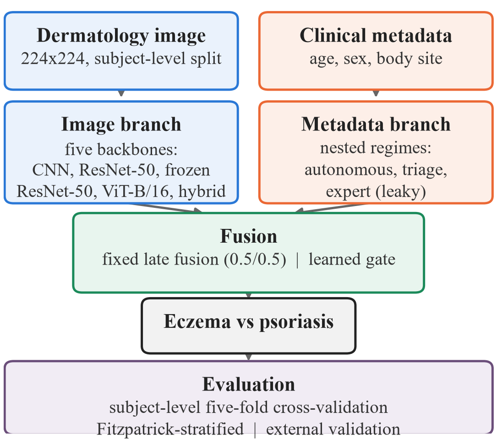

<h1 align="center">DermaFair</h1>

<p align="center">
  <b>Skin-tone-stratified external validation of eczema–psoriasis classifiers</b><br>
  Image, metadata and multimodal models, tested on one development cohort and two external cohorts
</p>

<p align="center">
  <a href="https://github.com/ethany8909/dermafair/actions/workflows/ci.yml"></a>
  
  
  
  <a href="LICENSE"></a>
</p>

---

Eczema and psoriasis look alike, and telling them apart is a frequent decision made without a
dermatologist. This repository holds the full code for a study of machine-learning models for that
differential:
- five image architectures, a clinical-metadata model and two fusion strategies, developed on 1,125
  images from 645 patients
- every model tested by Fitzpatrick skin-tone group, internally and on two independent external
  cohorts
- a follow-up study of ten proposed improvements, from foundation-model features to AI-generated
  training images

The central result is methodological: **internal validation did not predict external
performance.** Internal analysis showed no skin-tone gap, yet on the first external cohort the
model was at chance on the darkest skin types. A foundation model removed that gap on that cohort,
but the improvement did not replicate on a second external cohort.

> [!NOTE]
> Research code. These models are not medical devices and must not be used for diagnosis.

## Key findings

1. **Internal validation hid a skin-tone failure.** Under five-fold, patient-level cross-validation no
   model showed a detectable skin-tone gap. On the external SCIN cohort the image model reached AUROC
   0.711 on Fitzpatrick I–IV but **0.503 (chance) on V–VI**, a gap of 0.208 (95% CI 0.024–0.393).
2. **Clinical metadata did not transfer.** Body site matched the best image model internally (AUROC
   0.780) but fell to chance externally (0.451). Trained in the other direction it was significantly
   *worse* than chance (0.364), because site–diagnosis associations reverse between populations.
   Expert morphologic descriptors leak the diagnosis (0.894 → 0.795 without them).
3. **Multimodal fusion gave no transferable gain.** Fusion never beat images alone in paired CV. Body
   site is recoverable from the image itself (AUROC 0.905). Where metadata is used, a learned
   **mid fusion beats fixed late fusion** (internal +0.039 [+0.016, +0.065]), but it only ties
   image-only.
4. **A foundation model plus matched labels improved internal AUROC from 0.786 to 0.880**
   (+0.094 [+0.057, +0.133]). Along the way we found that 187 of the 406 "psoriasis" images were other
   diseases, mostly lichen planus.
5. **Gains on one external cohort did not replicate on a second.** On SCIN the new model lifted
   darker-skin AUROC from 0.503 to 0.666. On Fitzpatrick17k, tested once under a
   [pre-specified plan](docs/PREREGISTRATION.md), the two models tied overall (0.725 each), and the
   original model did not fail on darker skin.
6. **Common remedies did not help at this scale:**
   - rebalancing (it raises sensitivity, not AUROC)
   - augmentation
   - synthetic features from a VAE or a diffusion model (both slightly harmful)
   - AI-generated images, where an off-the-shelf generator erased lesions or could not depict the
     diseases on dark skin

<picture>
  <source media="(prefers-color-scheme: dark)" srcset="docs/figures/cross_cohort_dark.png">
  
</picture>

Full tables, intervals and figures: **[docs/RESULTS.md](docs/RESULTS.md)**.

## Study design



| Cohort | Role | Images | Skin tones |
|---|---|---|---|
| [DermaCon-IN](https://doi.org/10.7910/DVN/W7OUZM) | Development | 1,125 from 645 patients | Fitzpatrick III–VI |
| [SCIN](https://github.com/google-research-datasets/scin) | External test 1 | 1,128 cases (113 psoriasis) | I–VI |
| [Fitzpatrick17k](https://github.com/mattgroh/fitzpatrick17k) | External test 2 | 204 atlas images (104 psoriasis) | I–VI |

**Protocol**
- Patient-level splits, jointly stratified by class and skin tone; five-fold CV.
- Three metadata regimes: autonomous (age, sex), triage (+ body site) and expert (+ descriptors).
- Skin tone reported as Fitzpatrick I–IV vs V–VI, with bootstrap intervals; paired comparisons
  resample patients, not photos.
- **Selection rule:** every choice between variants is made on internal data. External cohorts are
  reported, never used to choose.

<br clear="right">

<picture>
  <source media="(prefers-color-scheme: dark)" srcset="docs/figures/technique_effects_dark.png">
  
</picture>

## Stack

| Layer | Tools |
|---|---|
| Deep learning | PyTorch, torchvision: CNN, ResNet-50, ViT-B/16, hybrid CNN–Transformer |
| Foundation models | DINOv2 ViT-S/B/L (frozen features, via `torch.hub`) |
| Classical ML and statistics | scikit-learn (logistic regression, SMOTE-style sampling, PCA, kNN imputation), SciPy, NumPy, pandas |
| Generative models | Conditional VAE and DDPM (PyTorch); SD-Turbo via Hugging Face `diffusers` |
| Fairness and evaluation | `dermafair.fairness`: per-tone metrics, gaps, Kruskal–Wallis, bootstrap and paired-bootstrap CIs |
| Image processing | Pillow, perceptual hashing (`imagehash`), CIELAB skin-tone transforms |
| Visualization | Matplotlib; Grad-CAM (optional) |
| Engineering | `pyproject` packaging, Ruff, pytest, GitHub Actions CI, Make |

All of it runs on a CPU; nothing requires a GPU.

## Repository structure

```text
├── dermafair/                 installable package
│   ├── data/                  splits, leakage audit, label rule, skin-tone colour science
│   ├── models/                image backbones, metadata model, late fusion, gate network
│   ├── fairness/              per-tone metrics, gaps, significance, bootstrap
│   ├── explainability/        Grad-CAM
│   ├── visualization/         figures and report helpers
│   └── paths.py               data and results locations (environment-configurable)
├── scripts/                   internal pipeline: data → train → evaluate → figures
├── experiments/
│   ├── external/              SCIN external validation and follow-up analyses
│   └── improvements/          improvement study, generated images, Fitzpatrick17k
├── examples/config_pipeline/  config-driven template for applying the protocol to new data
├── tests/                     unit tests
├── docs/                      data, reproduction, results, metrics, pre-registration, figures
└── Makefile                   every stage, in order, with the exact arguments used
```

## Getting started

```bash
git clone https://github.com/ethany8909/dermafair.git
cd dermafair
python -m venv .venv && source .venv/bin/activate     # Windows: .venv\Scripts\activate
pip install -e ".[dev]"
make test
```

The datasets are not included. Download them from their publishers ([docs/DATA.md](docs/DATA.md))
and point the code at them:

```bash
export DERMAFAIR_DATA_DIR=/path/to/data          # cohorts and the manifests derived from them
export DERMAFAIR_RESULTS_DIR=/path/to/results    # optional; defaults to ./results
```

Then reproduce any stage, or everything, with `make` ([docs/REPRODUCING.md](docs/REPRODUCING.md)):

```bash
make data internal spectrum      # internal benchmarking
make external                    # SCIN external validation
make improvements                # foundation models and the improvement study
make synthetic-images            # AI-generated training images
make fitzpatrick17k              # second external test, scored once
```

The fairness evaluator also works on its own with any classifier's predictions:

```python
from dermafair.fairness import FairnessEvaluator

report = FairnessEvaluator(sensitive_attr="fitzpatrick").evaluate(y_true, y_pred, groups, n_bootstrap=1000)
print(report.fairness_score, report.max_gap, report.kruskal_p)
```

## Data, privacy and limitations

- **No patient data in the repository.** It contains no patient images, metadata or derived arrays.
  `.gitignore` blocks images, arrays and checkpoints anywhere in the tree, and every output goes to
  `DERMAFAIR_RESULTS_DIR`. The cohorts are for non-commercial research under their own licenses.
- **Small darker-skin samples.** Results on darker skin rest on 40–106 images per cohort, so
  intervals are wide. Skin-tone results also differed between the two external cohorts.
- **Coverage gaps.**
  - The development cohort has no Fitzpatrick I–II.
  - Only 255 of Fitzpatrick17k's 1,837 relevant images could be downloaded, because one source
    site is offline.
  - The keyword-based label harmonization has not yet been reviewed by a dermatologist.

## Citation

A manuscript describing this work is in preparation. Until then, please cite the software
([CITATION.cff](CITATION.cff)):

```bibtex
@software{yu_dermafair_2026,
  author  = {Yu, Ethan and Yu, Nolan},
  title   = {DermaFair: Skin-tone-stratified external validation of eczema--psoriasis classifiers},
  year    = {2026},
  version = {0.2.0},
  url     = {https://github.com/ethany8909/dermafair}
}
```

## Acknowledgments

We thank Prof. Hajar Homayouni (San Diego State University) for advising this project; her review
motivated the model-improvement experiments. We thank the creators of DermaCon-IN, SCIN and
Fitzpatrick17k for making their data available for research.

## License

Code is released under the [MIT License](LICENSE). The datasets are licensed separately by their
publishers and are not redistributed here.
