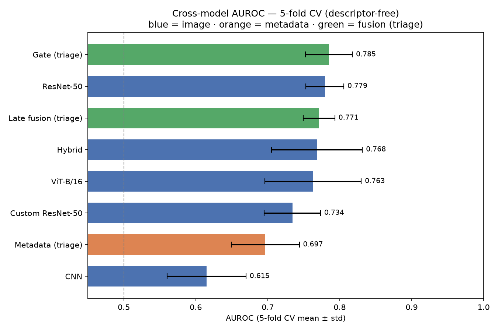
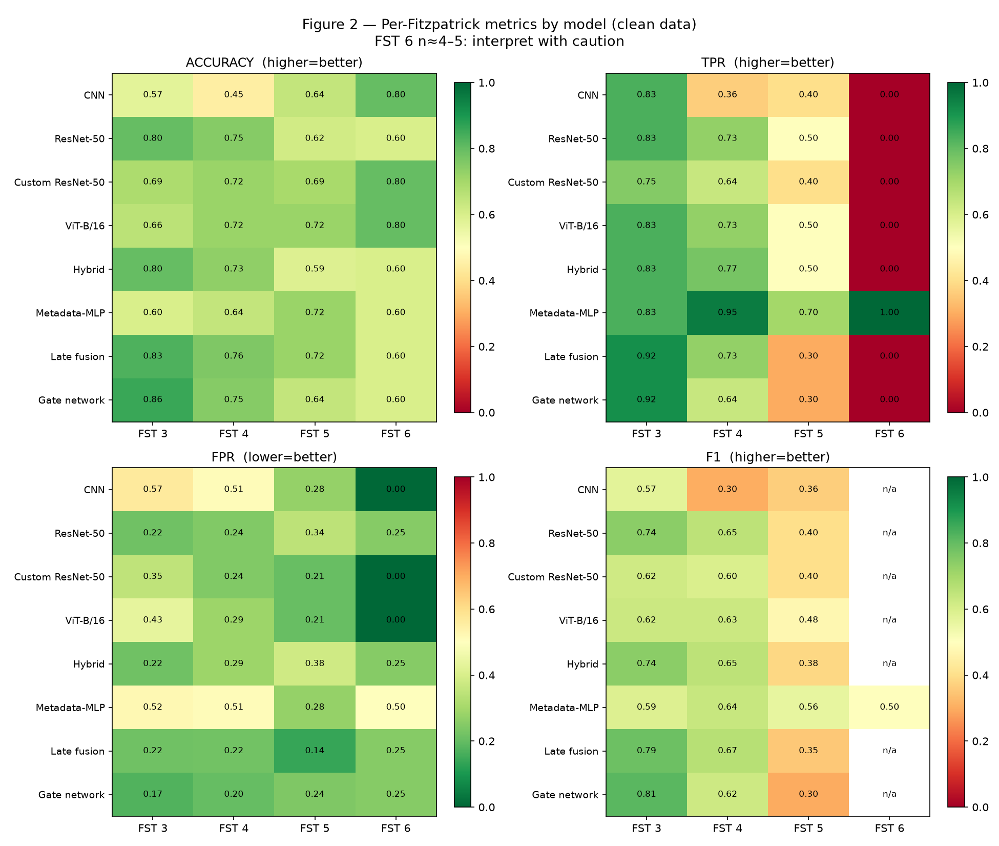
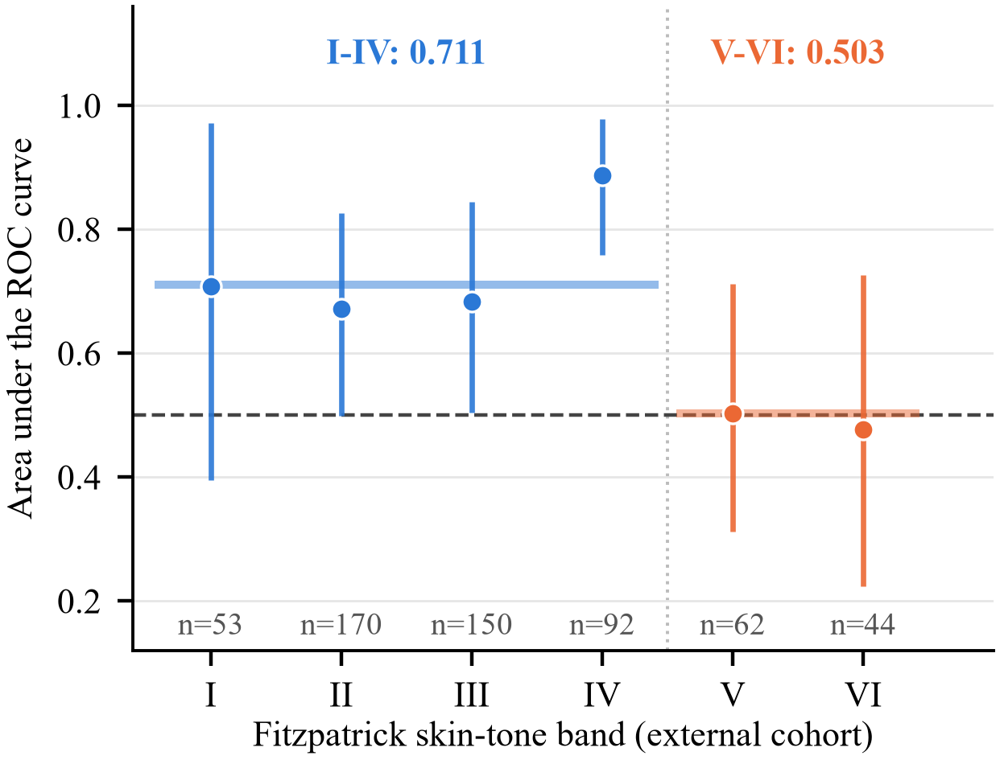
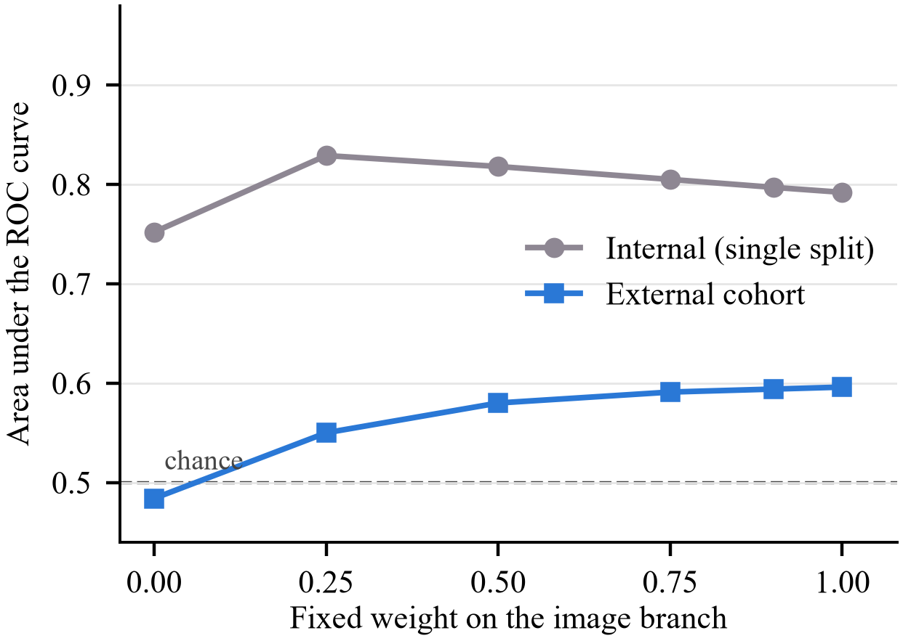
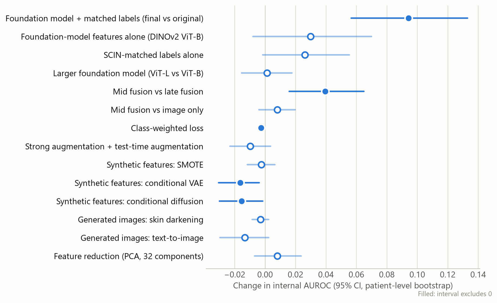
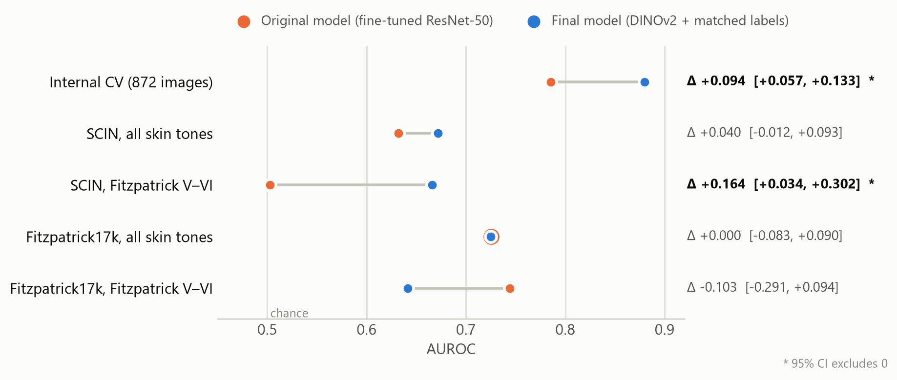

# Results

Aggregate results for every analysis in the repository. Metric definitions and interval
methods are in [METRICS.md](METRICS.md). AUROC treats psoriasis as the positive class.

- [1. Internal benchmarking](#1-internal-benchmarking)
- [2. External validation on SCIN](#2-external-validation-on-scin)
- [3. Model improvement experiments](#3-model-improvement-experiments)
- [4. Second external test: Fitzpatrick17k](#4-second-external-test-fitzpatrick17k)
- [5. Summary across cohorts](#5-summary-across-cohorts)

## 1. Internal benchmarking

### Image architectures (five-fold CV, mean (SD))

| Model | AUROC | Balanced accuracy | F1 | ECE |
|---|---|---|---|---|
| CNN (from scratch) | 0.615 (0.055) | 0.564 (0.035) | 0.500 (0.049) | 0.106 (0.060) |
| ResNet-50, frozen backbone | 0.734 (0.039) | 0.669 (0.051) | 0.578 (0.082) | 0.082 (0.027) |
| ViT-B/16 | 0.763 (0.067) | 0.695 (0.062) | 0.618 (0.084) | 0.192 (0.064) |
| Hybrid CNN–Transformer | 0.768 (0.063) | 0.686 (0.038) | 0.597 (0.047) | 0.174 (0.070) |
| **ResNet-50, fine-tuned** | **0.779 (0.026)** | **0.714 (0.046)** | **0.626 (0.073)** | 0.141 (0.038) |

The top four are statistically indistinguishable. ResNet-50 is the most stable and becomes the reference image model.

### Clinical-information spectrum (metadata regimes)

| Model | Autonomous (age, sex) | Triage (+ body site) | Expert (+ descriptors) | Triage, 5-fold CV |
|---|---|---|---|---|
| Metadata only | 0.591 | 0.780 | 0.907 | 0.697 (0.047) |
| Late fusion (0.5 / 0.5) | 0.779 | 0.820 | 0.949 | 0.771 (0.022) |
| Gate network | 0.789 | 0.809 | 0.916 | 0.785 (0.033) |

**Descriptor leakage.** Removing the clinician-recorded morphologic descriptors lowers metadata AUROC from 0.894 to 0.795, and descriptors alone reach 0.831. Descriptors carry the diagnosing dermatologist's reasoning, so the leakage-free **triage** regime is the primary operating point.

**Fusion vs images (paired, five folds, triage).**

| Comparison | Mean difference | 95% CI | *P* |
|---|---|---|---|
| Late fusion − ResNet-50 | −0.008 | −0.043 to +0.027 | .56 |
| Gate network − ResNet-50 | +0.006 | −0.016 to +0.027 | .51 |
| Metadata only − ResNet-50 | **−0.083** | −0.147 to −0.018 | **.02** |

No fusion strategy beats the image model. A single-split advantage (0.829 vs 0.792) does not survive cross-validation.

**Calibration.** ECE is 0.067 for late fusion, 0.079 for metadata only, 0.143 for the gate network and 0.144 for the image model.

### Skin tone, internally

No model shows a statistically distinguishable skin-tone gap (all Kruskal–Wallis *P* > .05). Every accuracy-gap interval is wide. The internal data contain no Fitzpatrick I–II images, and Fitzpatrick VI has about four test images, so these results are descriptive.

### Floors

| Baseline | Accuracy | AUROC |
|---|---|---|
| Majority class | 0.692 | — |
| Stratified random | 0.527 | 0.500 |
| Colour-histogram logistic regression | 0.582 | 0.538 |

Diagnosis is not recoverable from colour or exposure. Integrity checks are in [reports/LEAKAGE_AUDIT.md](reports/LEAKAGE_AUDIT.md).

## 2. External validation on SCIN

The image model was applied unchanged. The metadata model was retrained in a feature space shared by both cohorts.

| Model | Internal | SCIN AUROC | 95% CI |
|---|---|---|---|
| Metadata only | 0.699 (SD 0.033) | 0.451 | 0.389–0.515 |
| Image, single model | 0.792 | 0.596 | 0.541–0.654 |
| Image, five-fold ensemble | 0.779 (SD 0.026) | **0.632** | 0.575–0.692 |
| — Fitzpatrick I–IV (n = 465, 39 psoriasis) | — | 0.711 | 0.607–0.798 |
| — Fitzpatrick V–VI (n = 106, 18 psoriasis) | — | **0.503** | 0.353–0.652 |
| — gap | — | **0.208** | **0.024–0.393** |

- **Metadata does not transfer.** Only 4 of 10 body sites keep their class direction across cohorts. Head and neck reverses: an eczema excess internally becomes a psoriasis excess in SCIN.
- **The images transfer, with a darker-skin failure.** The SCIN failure on Fitzpatrick V–VI was invisible internally.

### Why fusion does not help externally

- **The rankings invert.** Internally, more metadata weight looks better; externally, less is always better.
- **The metadata is redundant.** Body site can be recovered from the image alone (AUROC 0.905), so the metadata adds little beyond what the image already contains.
- **The gate drops it.** A gate trained with modality dropout drives its metadata weight to 0.001.

### Follow-up analyses

| Analysis | Result |
|---|---|
| Leave one source out (within the internal cohort) | Mild degradation and no darker-skin gap: V–VI 0.786 and 0.677, with 168–172 darker-skin cases per test set. Source splits do not anticipate the external failures. |
| Reverse validation (train on SCIN, test internally) | Images: 0.679 (forward 0.632), so the drop is symmetric. Metadata: **0.364** (0.331–0.398), significantly below chance, so the associations invert. Darker-skin gap 0.009. |
| Tone-aware loss reweighting | SCIN 0.632 → 0.668; V–VI 0.503 → 0.591; gap 0.208 → 0.121 (−0.056 to 0.299). A partial mitigation. |

## 3. Model improvement experiments

These address the review feedback.

**Shared protocol:**
- frozen-feature screening on the same five folds
- harmonized labels, scored on the same 872 images
- choices made on internal results only
- adoption requires a paired internal CI above zero

### Final model vs the original model

| Model | Internal AUROC | Balanced accuracy | Psoriasis sensitivity | SCIN AUROC (95% CI) | FST I–IV | FST V–VI | Gap |
|---|---|---|---|---|---|---|---|
| Fine-tuned ResNet-50 (original) | 0.786 | 0.743 | 0.699 | 0.632 (0.573–0.690) | 0.711 | 0.503 | 0.208 |
| **DINOv2 ViT-B/14 + harmonized labels + class weights** | **0.880** | **0.792** | **0.717** | **0.672** (0.620–0.723) | 0.703 | **0.666** | **0.037** |
| DINOv2 ViT-L/14, same recipe (not selected) | 0.881 | 0.823 | 0.758 | 0.704 (0.655–0.753) | 0.737 | 0.682 | 0.054 |

Paired against the original model:
- **internal:** +0.094 [+0.057, +0.133]
- **SCIN overall:** +0.040 [−0.012, +0.093]
- **SCIN V–VI:** +0.164 [+0.034, +0.302]
- **SCIN I–IV:** −0.008 [−0.108, +0.096]

ViT-L was no better internally (+0.001), so the selection rule keeps ViT-B.

**Exceptions to the adoption rule, stated openly.** The backbone (+0.030 [−0.008, +0.070]) and the labels (+0.026 [−0.001, +0.055]) each narrowly missed the rule on their own. Both were motivated in advance and together pass decisively, so they were adopted as a pair. Class weights were kept for sensitivity, not AUROC.

<picture>
  <source media="(prefers-color-scheme: dark)" srcset="figures/technique_effects_dark.png">
  
</picture>

### Adoption tests

Paired ΔAUROC with 95% CIs. Internal intervals come from a patient-level bootstrap.

| Technique (vs its reference) | Internal | SCIN | SCIN FST V–VI |
|---|---|---|---|
| DINOv2 ViT-B vs fine-tuned ResNet-50 (original labels) | +0.030 (−0.008, +0.070) | +0.010 (−0.046, +0.066) | +0.098 (−0.026, +0.232) |
| DINOv2 ViT-L vs ViT-B | +0.001 (−0.015, +0.018) | +0.032 (+0.001, +0.062) | +0.016 (−0.068, +0.106) |
| Harmonized vs original labels | +0.026 (−0.001, +0.055) | +0.037 (+0.006, +0.068) | +0.076 (−0.013, +0.169) |
| Class-weighted loss vs none | −0.003 (−0.005, −0.001) | −0.007 (−0.011, −0.003) | −0.011 (−0.026, +0.001) |
| Strong augmentation + TTA vs none | −0.010 (−0.023, +0.004) | +0.035 (+0.005, +0.065) | 0.000 (−0.086, +0.085) |
| Gaussian-noise synthetic features | +0.009 (−0.000, +0.019) | −0.001 (−0.008, +0.004) | −0.001 (−0.020, +0.018) |
| SMOTE | −0.002 (−0.012, +0.006) | −0.010 (−0.023, +0.002) | −0.005 (−0.032, +0.020) |
| Conditional VAE | **−0.016 (−0.031, −0.004)** | +0.001 (−0.012, +0.015) | +0.009 (−0.016, +0.037) |
| Conditional diffusion model | **−0.015 (−0.030, −0.002)** | +0.002 (−0.012, +0.016) | −0.027 (−0.067, +0.007) |
| PCA-32 vs all 1,536 dimensions | +0.008 (−0.007, +0.024) | −0.007 (−0.027, +0.012) | −0.011 (−0.056, +0.035) |
| Simulated missingness vs unknown indicator | +0.005 (−0.002, +0.014) | −0.012 (−0.024, −0.000) | −0.002 (−0.031, +0.028) |
| **Mid fusion vs late fusion** | **+0.039 (+0.016, +0.065)** | **+0.053 (+0.009, +0.098)** | +0.109 (−0.047, +0.269) |
| Mid fusion vs image only | +0.008 (−0.004, +0.020) | −0.023 (−0.041, −0.005) | −0.006 (−0.049, +0.043) |

### What each technique showed

- **Imbalance.** AUROC is flat (0.878–0.883), as expected for a ranking metric. Class weights raise psoriasis sensitivity from 0.607 to 0.717.
- **Augmentation.** Internal AUROC drops slightly while SCIN rises (best 0.707 with TTA). It is not adopted under the internal-only rule.
- **Synthetic features.** Noise and SMOTE produce near-copies of real samples (99% and 85%). The generative models produce new samples that carry the class signal (train-on-synthetic 0.83–0.84), but add nothing beyond the few hundred cases they learned from.
- **Missing values.** SCIN lacks age for 51% of cases, sex for 44% and body site for 15%. Metadata-only SCIN AUROC stays at 0.454–0.467 under five strategies, so missingness is ruled out as the cause of the metadata failure.
- **Mid vs late fusion** (DINOv2 features, three seeds):

| Model | Internal | SCIN | FST I–IV | FST V–VI |
|---|---|---|---|---|
| Image only | 0.862 | 0.681 | 0.717 | 0.605 |
| Late fusion (0.5 / 0.5) | 0.831 | 0.606 | 0.647 | 0.491 |
| **Mid fusion, concatenation + modality dropout** | **0.870** | 0.659 | 0.693 | 0.600 |
| Mid fusion, FiLM | 0.856 | 0.671 | 0.725 | 0.628 |

- **End-to-end confirmation** (fine-tuned ResNet-50, harmonized labels). Relabeling alone changes nothing: 0.782 internal, 0.638 SCIN, 0.500 V–VI. The darker-skin gain therefore comes from the foundation-model representation. Mid fusion trained end to end beats late fusion on SCIN by +0.073 [+0.018, +0.126] and ties image-only.

### Image-level synthetic data (SD-Turbo)

Four sets, each built from the 597 lighter-skin training images or, for text-to-image, generated from prompts:

| Set | Median skin ITA | Distinguishable from photos (C2ST) | Train on synthetic → real (V–VI) | Internal Δ | Internal V–VI Δ |
|---|---|---|---|---|---|
| Darkened (colour transform) | −34.3 | 0.73 | 0.880 (0.829) | −0.003 (−0.009, +0.002) | +0.004 (−0.009, +0.016) |
| Darkened + generator pass | −31.9 | 0.97 | 0.869 (0.821) | −0.006 (−0.014, +0.001) | +0.003 (−0.014, +0.023) |
| Generator pass only (control) | 10.5 | 0.96 | 0.872 (0.824) | −0.006 (−0.013, +0.001) | +0.001 (−0.016, +0.021) |
| Text-to-image | −27.6 | 1.00 | **0.624 (0.521)** | −0.013 (−0.030, +0.002) | **−0.040 (−0.078, −0.005)** |

For reference, the median skin ITA of real Fitzpatrick V–VI images is −33.0.

- **Nothing is adopted.**
- **The generator erases lesions.** Re-rendering photos at ordinary strengths smoothed the lesions into healthy-looking skin; only the lightest setting kept them visible.
- **It cannot depict these diseases on dark skin.** The text-to-image set trains a classifier that is at chance on real darker-skin photos.

## 4. Second external test: Fitzpatrick17k

Tested once, under the plan in [PREREGISTRATION.md](PREREGISTRATION.md): 204 atlas images, 104 psoriasis; 57 on Fitzpatrick V–VI, 40 of them psoriasis. No image was a near-copy of a training or SCIN image.

| Model | AUROC [95% CI] | FST I–IV | FST V–VI [95% CI] | Gap |
|---|---|---|---|---|
| Fine-tuned ResNet-50 (original) | 0.725 [0.654–0.794] | 0.729 | **0.744** [0.589–0.870] | −0.015 |
| **Final model** | 0.725 [0.654–0.801] | 0.756 | 0.641 [0.479–0.794] | 0.115 |
| DINOv2 ViT-L (secondary) | 0.737 [0.666–0.811] | 0.766 | 0.685 [0.525–0.836] | 0.081 |
| Final + darkened synthetic images (secondary) | 0.740 [0.668–0.814] | 0.769 | 0.646 [0.488–0.795] | 0.123 |

| Comparison | Overall Δ [95% CI] | V–VI Δ [95% CI] |
|---|---|---|
| **Final − original (primary endpoint)** | **+0.000 [−0.083, +0.090]** | −0.103 [−0.291, +0.094] |
| Same, alternative skin-tone labels | +0.000 | −0.008 [−0.177, +0.167] |
| Same, keyword-rule labels (n = 255) | +0.045 [−0.033, +0.123] | −0.105 [−0.258, +0.056] |
| Same, strict-core labels (n = 155) | −0.016 [−0.115, +0.085] | −0.165 [−0.344, +0.003] |
| ViT-L − ViT-B | +0.012 [−0.017, +0.041] | +0.044 [−0.035, +0.117] |
| ViT-L − ViT-B, keyword-rule labels | **+0.038 [+0.009, +0.067]** | +0.069 [−0.003, +0.141] |
| Darkened synthetic − final | **+0.015 [+0.004, +0.026]** | +0.004 [−0.034, +0.044] |

**What this shows:**
- **The primary endpoint is null.**
- **The SCIN darker-skin results do not replicate.** On these atlas photos the original model does not fail on darker skin, and the final model is nominally lower. The darker-skin comparison also moves by about 0.1 with the annotator's skin-tone labels.
- **ViT-L is now ahead externally on both cohorts,** though not internally. It is the natural candidate for the next pre-specified test.

## 5. Summary across cohorts

<picture>
  <source media="(prefers-color-scheme: dark)" srcset="figures/cross_cohort_dark.png">
  
</picture>

| Test set | Original | Final | Paired Δ [95% CI] |
|---|---|---|---|
| Internal CV (872 images) | 0.786 | 0.880 | **+0.094 [+0.057, +0.133]** |
| SCIN, all | 0.632 | 0.672 | +0.040 [−0.012, +0.093] |
| SCIN, FST V–VI | 0.503 | 0.666 | **+0.164 [+0.034, +0.302]** |
| Fitzpatrick17k, all | 0.725 | 0.725 | +0.000 [−0.083, +0.090] |
| Fitzpatrick17k, FST V–VI | 0.744 | 0.641 | −0.103 [−0.291, +0.094] |

The defensible claims are the internal improvement, and that **internal results did not predict external ones**. Skin-tone results also differed between the two external cohorts. Fairness conclusions in dermatology AI need more than one external cohort, and more darker-skin images than any of these datasets provide.
